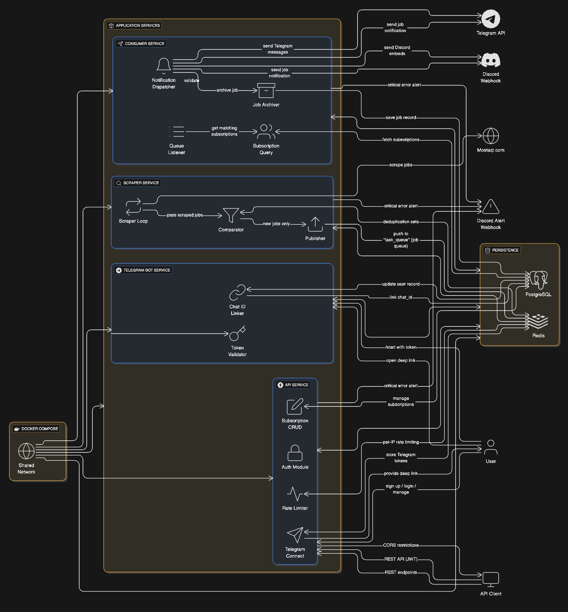

# First - Job Notification Service

Real-time job notification service that scrapes freelance job listings and delivers instant alerts via Discord webhooks or Telegram.

## Tech Stack

- **Backend**: Python 3.13, FastAPI, Pydantic v2
- **Database**: PostgreSQL, SQLAlchemy (async)
- **Queue**: Redis
- **Scraping**: Playwright
- **Notifications**: Telegram Bot API, Discord Webhooks
- **Infrastructure**: Docker, Docker Compose, Alembic

## Architecture



## Services

| Service | Description |
|---------|-------------|
| **scraper** | Scrapes Mostaql.com every 3 minutes for new jobs |
| **consumer** | Processes job queue and sends notifications |
| **api** | FastAPI REST API for user management |
| **telegram-bot** | Handles Telegram account linking |

## Getting Started

### Prerequisites

- Docker & Docker Compose
- (Optional) Python 3.13 for local development

### Setup

1. Clone the repository:
```bash
git clone https://github.com/AlShabiliBadia/First.git
cd First
```

2. Create environment file:
```bash
cp backend/src/.env.example backend/src/.env
# Edit .env with your credentials
```

3. Start all services:
```bash
docker compose up -d --build
```

4. Run database migrations:
```bash
docker compose exec api alembic upgrade head
```

5. Access the API docs:
```
http://localhost:8000/docs
```

## Environment Variables

| Variable | Required | Description |
|----------|----------|-------------|
| `REDIS_PASS` | ✅ | Redis password |
| `POSTGRES_PASSWORD` | ✅ | PostgreSQL password |
| `SECRET_KEY` | ✅ | JWT signing key |
| `TELEGRAM_TOKEN` | ✅ | Telegram bot token from @BotFather |
| `TELEGRAM_BOT_USERNAME` | ✅ | Bot username (without @) |
| `ALERT_WEBHOOK` | ❌ | Discord webhook for error alerts |
| `TURNSTILE_SECRET_KEY` | ❌ | Cloudflare Turnstile secret |

## API Endpoints

### Auth
- `POST /v1/auth/signup` - Create account
- `POST /v1/auth/login` - Get access token
- `POST /v1/auth/refresh` - Refresh token

### Users
- `GET /v1/users/me` - Get current user
- `POST /v1/users/connect-telegram` - Generate Telegram link token

### Subscriptions
- `GET /v1/subscriptions` - List subscriptions
- `POST /v1/subscriptions` - Create subscription
- `DELETE /v1/subscriptions/{id}` - Delete subscription
- `POST /v1/subscriptions/{id}/test` - Test notification
